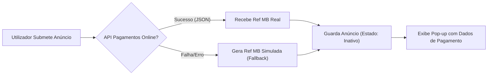

# 🏠 AE Alojamento

> **Plataforma de Gestão de Alojamento Universitário**

Esta aplicação é uma solução web desenvolvida para a **Associação de Estudantes**, visando facilitar a conexão entre estudantes que procuram alojamento e proprietários (ou outros alunos) que disponibilizam quartos ou apartamentos.

Ao contrário de plataformas genéricas, o **AE Alojamento** foca-se na comunidade académica, com um sistema de validação de utilizadores e integração simulada de pagamentos para destacar anúncios.

---

## 🛠️ Tech Stack

O projeto foi construído sobre uma arquitetura robusta e moderna em Java:

* **Backend:** Java 17, Spring Boot 3.2
* **Frontend:** Vaadin Flow (Java-based UI, sem necessidade de JS/HTML complexo)
* **Base de Dados:** PostgreSQL
* **Segurança:** Spring Security (BCrypt & Role-based Access)
* **Build Tool:** Maven

---

## 🗺️ Roadmap Funcional da Aplicação

Este roteiro descreve o ciclo de vida da aplicação, desde a visita de um utilizador anónimo até à gestão administrativa.

### 1. 🌐 Acesso Público (Visitante)
Qualquer pessoa que aceda ao site entra neste fluxo inicial.

* **Landing Page (`HomeView`)**:
    * Apresentação da plataforma.
    * **Destaques Automáticos:** O sistema carrega e exibe os **3 anúncios mais recentes** inseridos na base de dados.
* **Listagem de Anúncios (`AnunciosView`)**:
    * Grelha completa com todos os anúncios **Ativos**.
    * **Identificação Visual:** Ícones distintos para "Oferta" (🏠) e "Procura" (🔍).

### 2. 🔐 Autenticação e Segurança
Para criar conteúdo, o utilizador deve estar registado.

* **Registo (`RegistoView`)**:
    * O utilizador cria conta.
    * ⚠️ **Estado Inicial:** A conta é criada como `Inativa` (`enabled = false`). O utilizador **não** consegue fazer login imediatamente; é necessária aprovação de um Administrador (medida de segurança da AE).
* **Login (`LoginView`)**:
    * Autenticação via Spring Security.
    * Redirecionamento inteligente após sucesso.

### 3. 📝 Ciclo de Criação de Anúncio (Utilizador)
Funcionalidade *core* para utilizadores autenticados.

1.  **Formulário**: Definição de preço, zona, tipo (Oferta/Procura) e descrição.
2.  **Pagamento & Integração Externa**:
    * O sistema comunica com uma API externa (`magno.di.uevora.pt`) para gerar referências Multibanco.
    * **Fallback Automático:** Se a API falhar, o sistema gera uma referência simulada para não bloquear o utilizador.
3.  **Persistência**: O anúncio é guardado como `Inativo` até confirmação (simulada) de pagamento.

### 4. 🛠️ Painel de Administração (Backoffice)
Acesso exclusivo a utilizadores com a role `ADMIN`.

* **Gestão de Utilizadores**:
    * Visualizar registos pendentes.
    * **Eliminação em Cascata:** Ao eliminar um utilizador malicioso, o sistema remove automaticamente todos os seus anúncios.
* **Moderação de Anúncios**:
    * Ativação/Desativação manual de anúncios (simulando moderação de conteúdo ou confirmação de pagamento).

---

## 🔄 Fluxo de Pagamento (Diagrama)

A aplicação possui um sistema resiliente para geração de referências de pagamento:


---


## 📂 Estrutura do Projeto

```text
├── ⚙️ pom.xml
src/main/java/com/ae/alojamento
├── 🚀 Application.java                # Ponto de entrada (Main) e Data Loader (Admin)
│
├── 📦 entity                          # Modelo de Dados (Entidades JPA)
│   ├── Anuncio.java                   # Representa a tabela de anúncios
│   └── User.java                      # Representa a tabela de utilizadores
│
├── 🗄️ repository                      # Camada de Acesso a Dados
│   ├── AnuncioRepository.java         # Queries SQL automáticas para anúncios
│   └── UserRepository.java            # Queries SQL automáticas para users
│
├── ⚙️ service                         # Lógica de Negócio
│   ├── AnuncioService.java            # Gestão de anúncios (CRUD, Destaques)
│   ├── AuthService.java               # Lógica de registo de novos utilizadores
│   ├── PagamentoService.java          # Cliente HTTP para API externa (Multibanco)
│   └── UsuarioService.java            # Lógica auxiliar de gestão de utilizadores
│
├── 🔐 security                        # Segurança (Spring Security)
│   ├── CustomUserDetailsService.java  # Carrega dados do User da BD para a sessão
│   ├── SecurityConfig.java            # Define rotas públicas vs privadas
│   └── SecurityService.java           # Utilitários (Logout, Get User Autenticado)
│
└── 🖥️ views                           # Interface de Utilizador (Frontend Vaadin)
    ├── MainLayout.java                # Layout Mestre (Menu Lateral e Cabeçalho)
    ├── HomeView.java                  # Landing Page (Página Inicial)
    ├── LoginView.java                 # Formulário de Login
    ├── RegistoView.java               # Formulário de Registo
    ├── AnunciosView.java              # Catálogo público de ofertas
    ├── FormularioView.java            # Criação de anúncios e pagamentos
    └── AdminView.java                 # Painel de Administração
src/main/resources
├── ⚙️ application.properties          # Configurações de BD, Porta e Hibernate
└── 📄 offline.html                    # Página de fallback (PWA)
```
